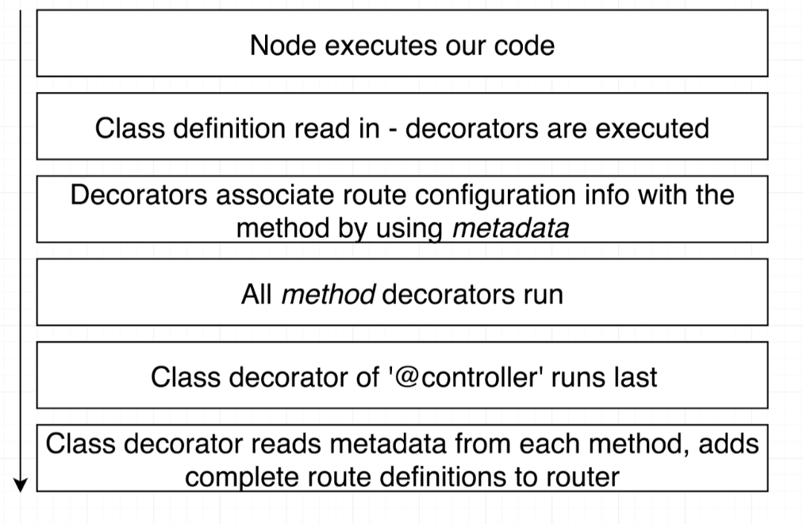

# Express Server + Route Decorators

## Description
An express server with session authentication via [cookie-session](https://github.com/expressjs/cookie-session) middleware.  
It provides a simplified implementation for route and middleware decorators as popularized by [Ts.ED](https://github.com/TypedProject/tsed)  


## To Start
`npm install`  
`npm run start`  

In your browser, navigate to:  
[http://localhost:3000/auth/login](http://localhost:3000/auth/login)

Valid credentials:  
u: `1@test.com`  
p: `password`

The following protected route is only accessible if the above user is logged in:  
[http://localhost:3000/protected](http://localhost:3000/protected)

## How it Works


## How To Use
1. Define a controller class in the `controllers` directory (ie: LoginController)
2. Provide a `baseUrl` as an argument to the `@controller` decorator and apply it to the controller class
3. Define method(s) within the class that will execute when the HTTP method is invoked on that route (ie: `get`, `post`)
4. To apply middleware(s), the `use` decorator is provided

Example:
```
function logger(req: Request, res: Response, next: NextFunction) {
  console.log('*** Logger middleware was called ***');
  next();
}

@controller('/auth')
class LoginController {
  @get('/login')
  @use(logger)
  getLogin(req: Request, res: Response): void {
    res.send('Response to browser');
  }
...
}
```

### Special Thanks
> Credit to Stephen Grider's course: Typescript: The Complete Developer's Guide where the initial implementation was designed.
> https://www.udemy.com/course/typescript-the-complete-developers-guide/